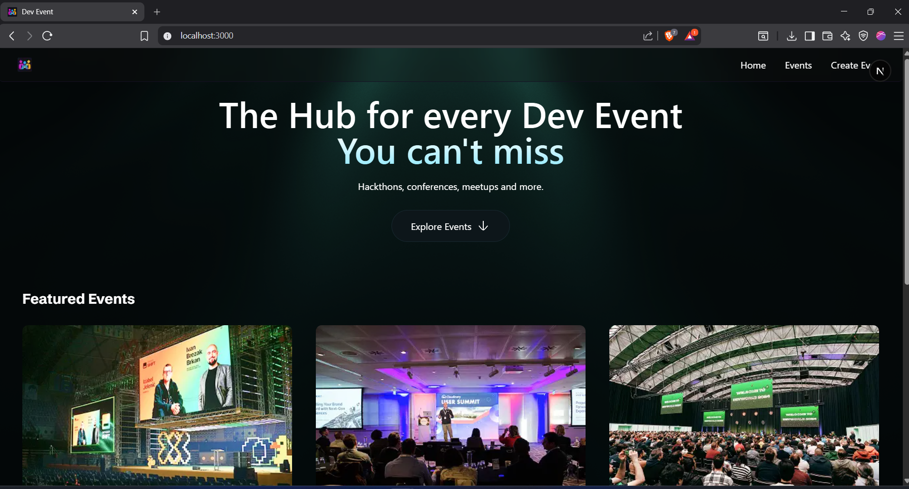

# 🎉 Event Management & Hosting Platform

A modern web application built with **Next.js** that allows users to create, manage, and explore events seamlessly. The platform focuses on performance, scalability, and user engagement tracking through integrated analytics.

---

## 🚀 Project Overview

This application enables users to:

- 📅 Create and host events  
- 📝 Manage event details  
- 🔍 Explore available events  
- 📊 Track user engagement and behavior  

Built using **Next.js** for optimized performance and SEO, with **PostHog analytics** integration for data-driven insights.

---

## 🛠️ Tech Stack

### Frontend & Framework
- Next.js  
- React.js  
- Tailwind CSS  

### Analytics
- PostHog (User behavior tracking & analytics)

---

## ✨ Key Features

- ⚡ Server-Side Rendering (SSR) & optimized performance  
- 🎨 Responsive UI with Tailwind CSS  
- 📊 Integrated PostHog analytics  
- 🧩 Scalable and modular project structure  
- 🔎 SEO-friendly architecture  

---
## 🏠 Homepage Preview

## 📂 Project Structure

event-management-platform/
│
├── components/
├── pages/
├── public/
├── styles/
├── screenshots/
│ └── homepage.png
└── README.md

---

## ⚙️ Installation & Setup

### 1️⃣ Clone the Repository

git clone https://github.com/your-username/event-management-platform.git
cd event-management-platform

2️⃣ Install Dependencies
npm install

3️⃣ Run Development Server
npm run dev

Application will run at:

http://localhost:3000

📊 PostHog Analytics Setup

Create an account at PostHog.

Copy your API key.

Create a .env.local file in the root directory and add:

NEXT_PUBLIC_POSTHOG_KEY=your_posthog_key
NEXT_PUBLIC_POSTHOG_HOST=https://app.posthog.com

Restart the development server.

🚀 Future Enhancements

🔐 Authentication system

💳 Event ticket booking & payments

📍 Location-based event filtering

📈 Admin dashboard with advanced analytics

☁️ CI/CD pipeline & production deployment

👨‍💻 Author

Girish Thorat
Full Stack Developer | Building Scalable Web Applications

Just tell me 🚀
